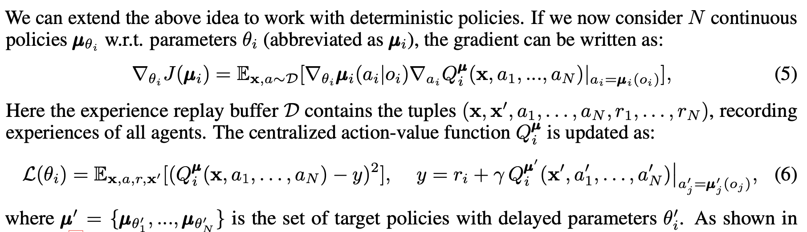

Questions to answer when starting out: 
- What can each agent see? 
- What is the agent? Both of the actors? Both of the critics? 
- How is credit assigned to an action? How many network have to be created? 

Based on my reading of the <a href="https://arxiv.org/pdf/1706.02275.pdf">MA-DDPG paper</a>, the multi-agent version differs from single agent DDPG in a few ways. 

* The critic sees, saves, and learns all actions 
* The actor sees all actions, but acts only for one agent 
* The action value function is similar, but not identical 

The action value function is calculated as follows: 

All other things are the same: 

What we add 
all agent states, all agent actions, all agent rewards 

Each agent sees everything