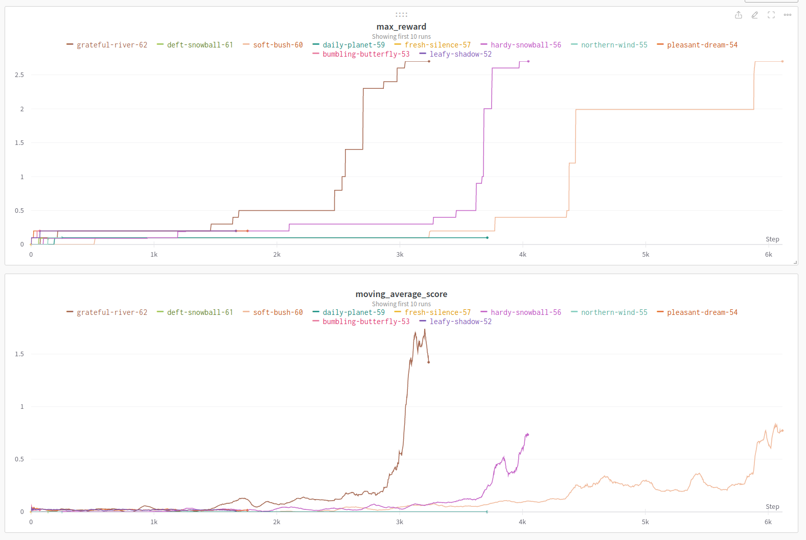

Questions to answer when starting out: 
- What can each agent see? 
- What is the agent? Both of the actors? Both of the critics? 
- How is credit assigned to an action? How many network have to be created? 

## What is the information flow through the program? 
### Flow level 1: 

1. The environment presents a state
1. Each actor observes it's local state, and infers an action 
2. The environment responds with a next_state, along with a reward
```
state -> action -> next_state, reward
```


Based on my reading of the <a href="https://arxiv.org/pdf/1706.02275.pdf">MA-DDPG paper</a>, the multi-agent version differs from single agent DDPG in a few ways. 
* The critic sees, saves, and learns all actions 
* The actor sees only it's perspective  

I decided to work on my previous DDPG code, and modify the agent and model to work as a multi-agent DDPG model.  
Principal differences: 
From Lowe et al.(2017): <i>"in which each agent trains a DDPG algorithm such that the actor with policy weights observes the local observations, while the critic is allowed to access the observations, actions, and the target policies of all agents in the training time. Then the critic of each agent concatenates all state-actions together as the input, and using the local reward obtains the corresponding Q-value. Either of the critics are trained by minimizing a DQN-like loss function." (shown below) </i>
 

Based on this I plan to modify the DDPG into a MADDPG using the following method. 


## Observation space
 - 24 vectors (not sure why Udacity say 8, maybe each vector has three directional components? )

## Action space 
- Two actions, space of actions is -1 to 1, inclusive.  
    Moves are in 1 dimension: forwards or back, and jump: up or down. 
    Each action looks like:  [signed_move_direction, signed_jump_distance]
        actions: [lefthand_agent, righthand_agent] 

## Rewards 
Reward are structured as follows: 
* 0.1 for ball over the net 
* -0.01 for ball out of bounds 

Overall goal is the keep the ball in play continuously 

Reward data shape: [reward1, reward2] 

## Dones
Done data shape: [donestatus1, donestatus2] 

Questions 
- Q: Does the critic take all the states and actions and the actor just takes in the individual actions? The actor has to make a choice about an individual agent's actions, right? 
- A: After reading the paper in section 4.1: 
    <i> The critic is augmented with extra information about the policies of the other agents</i>
    Also the paper (a review of cooperative multi-agent deep reinforcement learning) explains that the agents act on their local observations and rewards, but the critic evaluates their actions based on the global actions  


# Learning algorithm  

I chose an MADDPG implimentation, since I had already created and trained a DDPG agent. The MADDPG agent is like having multiple DDPG agents, with one big difference being that the critic gets to see all of the states. For the MADDPG implimentation I wrote a wrapper meta-agent(AgentOrchestrator) to hook into DDPG and get actions from each agent, learn, step, etc. I also move the replay buffer out of the individual agents into the meta-agent. 

1. Predict the next action by querying each target actor network for the next action 
2. Get the expected reward of those actions by sending the target critic network the all the next actions and all the next states  
3. Get the expected reward of the current (target network?) using: 
    y = agent_reward + gamma * (estimated_next_action_reward)
    Q_t = r_agent + (gamma * Q_t_next * (1 - dones)) 
4. Minimize the reward 
    Also the paper (A review of cooperative multi-agent deep reinforcement learning) explains that the agents act on their local observations and rewards, but the critic evaluates their actions based on the global actions 


# Hyperparameters
I largely stuck to previously used hyperparameters. I changed the batch size to 256, tried a couple variations of gamma, adjusted the actor and critic learning rates between 0.001 and 0.0001. I also modified how I was decreasing the noise in this model vs my DDPG implimentation. 
The final adjustment was changing the network shape. Previously I had used a 128x128 size network for the DDPG agents, but this time I tried a few variations and found 128x64 to train the fastest with the highest rewards. Final hyperparameters are below: 

    "BUFFER_SIZE": 100000,     
    "BATCH_SIZE" : 256,              
    "GAMMA" : 0.995,                  
    "TAU" : 1e-3,                     
    "LR_ACTOR" : 1e-4,                 
    "LR_CRITIC" : 1e-4,               
    "WEIGHT_DECAY": 0,              
    "num_episodes": 20000, 
    "max_timesteps": 1000,  
    "actor_network_shape": [128, 64, 0],   
    "critic_network_shape": [128, 64, 0],   
    "LEARN_EVERY": 1,  
    "N_RETRAININGS": 1,   
    "NOISE_DECAY": 0.0001  


# Plot of rewards 
Rewards are plotting using Weights and Biases. The final three training sessions clearly show a marked difference. The 60 and 61 training sessions are using a 128x128 size network, with some other hyperparameters. The grateful-river-62 session is using a 128x64 size network, with hyperparameters as stated above.

Saved weights are in named folders under ./checkpoints/

 
