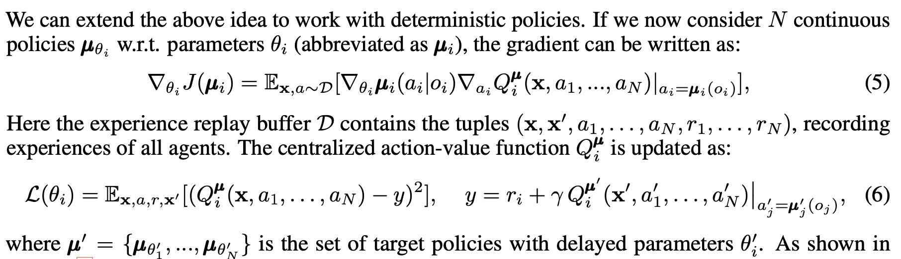

Questions to answer when starting out: 
- What can each agent see? 
- What is the agent? Both of the actors? Both of the critics? 
- How is credit assigned to an action? How many network have to be created? 

Based on my reading of the <a href="https://arxiv.org/pdf/1706.02275.pdf">MA-DDPG paper</a>, the multi-agent version differs from single agent DDPG in a few ways. 

* The critic sees, saves, and learns all actions 
* The actor sees all actions, but acts only for one agent 
* The action value function is similar, but not identical 

The action value function is calculated as follows: 

I decided to work on my previous DDPG code, and modify the agent and model to work as a multi-agent DDPG model.  
Principal differences: 
From Lowe et al.(2017): <i>"in which each agent trains a DDPG algorithm such that the actor with policy weights observes the local observations, while the critic is allowed to access the observations, actions, and the target policies of all agents in the training time. Then the critic of each agent concatenates all state-actions together as the input, and using the local reward obtains the corresponding Q-value. Either of the critics are trained by minimizing a DQN-like loss function." (shown below) </i>
 

Based on this I plan to modify the DDPG into a MADDPG using the following method. 

Problems: 
- Should each agent be a separate instance of a class? Yes, moving to one MADDPG class which interacts with a DDPG instance for each agent 

Plan 
1. Save the observations of both agents with labels (0, 1, 2, ... n) 
2. Modify ddpg so the actor only sees it's interaction, but the critic sees all the concatenated actions 
3. After that not sure, I'll start and see what happens 

## Observation space
- Two actions, space of actions is -1 to 1, inclusive.  
    Moves are in 1 dimension: forwards or back, and jump: up or down. 
    Each action looks like:  [signed_move_direction, signed_jump_distance]
        actions: [lefthand_agent, righthand_agent]

## What happened 
* At first the agents just started jumping towards each-other into the net each timestep and the episode would end when they collided. They did not appear to be taking any random actions. I realized that the agents were not taking negative direction actions for either moves or jumps
* 

Questions 
- Q: Does the critic take all the states and actions and the actor just takes in the individual actions? The actor has to make a choice about an individual agent's actions, right? 
- A: After reading the paper in section 4.1: 
    <i> The critic is augmented with extra information about the policies of the other agents</i>